# 控件总览

CheemsUI 全部 **42 个控件**的清单与动效演示。图片均由 Demo 程序自动实录生成（Loader 为 24fps GIF，其余为关键状态截图）。

## Buttons（8）

每个按钮展示 常态 / 悬停 / 按下 三态：

| 控件 | 常态 | 悬停 | 按下 |
|---|---|---|---|
| `CheemsShineButton` 流光扫过式主按钮 | 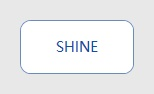 |  | 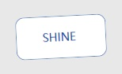 |
| `CheemsLayered3DButton` 层叠立体按压按钮 |  |  |  |
| `CheemsSoftButton` 柔和底色按钮，按下带形变 |  |  |  |
| `CheemsDashedButton` 虚线描边按钮 | 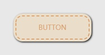 |  | 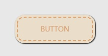 |
| `CheemsSubscribeButton` 订阅按钮，点击后勾选动效 |  |  |  |
| `CheemsDeleteButton` 删除按钮，悬停出确认叉 |  |  |  |
| `CheemsPixelHandButton` 像素风手指按钮 |  |  |  |
| `CheemsLeafButton` 叶形按钮 | 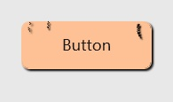 | 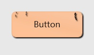 | 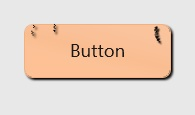 |

## Loaders（17）

全部为无限循环动画，放入界面即自动播放；每个控件在 `Themes/Controls/*.xaml` 里有对应的专属配色键可覆盖。

| | | |
|---|---|---|
|  | 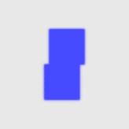 |  |
| **AiMatrix** | **Blob** | **BounceBall** |
|  | 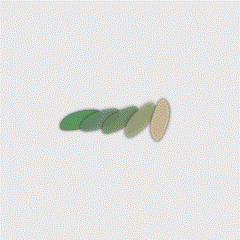 |  |
| **CubeLoading** | **Domino** | **Earth** |
| 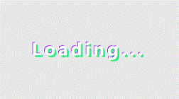 |  |  |
| **Glitch** | **HamsterWheel** | **JumpingSquare** |
|  |  | 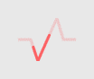 |
| **NewtonsCradle** | **OrbitDots** | **Polyline** |
|  |  |  |
| **PulseDots** | **RainbowBars** | **Typewriter** |
|  |  | |
| **WashingMachine** | **WaveBars** | |

## Inputs（13）

开关类展示 关 / 开 两态：

| 控件 | 关 | 开 |
|---|---|---|
| `CheemsDayNightSwitch` 昼夜形态渐变开关 |  |  |
| `CheemsCheckToggle` 经典勾选开关 | 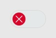 |  |
| `CheemsAmPmToggle` 上午 / 下午开关 | 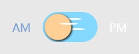 | 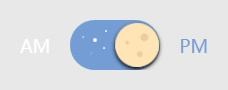 |
| `CheemsGenderToggle` 性别选择开关 | 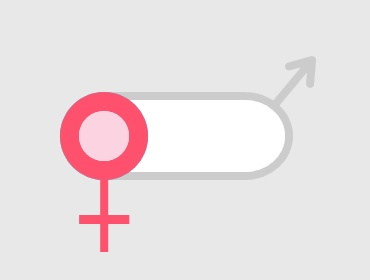 | 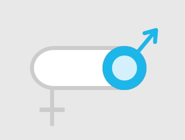 |
| `CheemsIosStretchSwitch` iOS 风拉伸开关 | 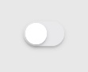 | 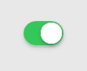 |
| `CheemsLedSwitch` LED 指示开关 | 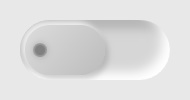 |  |
| `CheemsMechanicalToggle` 机械拨杆开关 | 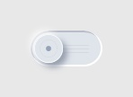 | 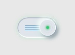 |
| `CheemsMetalSwitch` 金属质感开关 | 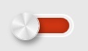 | 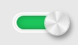 |
| `CheemsPixelSwitch` 像素风开关 | 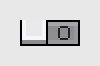 | 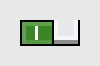 |
| `CheemsPixelCoinSwitch` 像素投币开关 | 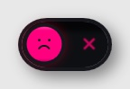 | 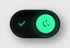 |
| `CheemsScaleSwitch` 天平式开关 |  |  |

输入框展示 常态 / 悬停（聚焦）两态：

| 控件 | 常态 | 聚焦 |
|---|---|---|
| `CheemsGlowInput` 聚焦发光输入框（`Placeholder` 属性） |  | 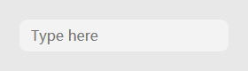 |
| `CheemsSearchBox` 搜索框（`Label` / `Text`，带清除按钮） | 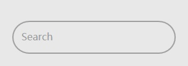 |  |

## Progress（4）

均继承自 `ProgressBar`，直接绑定 `Value` / `Minimum` / `Maximum` 使用：

| 控件 | 演示 |
|---|---|
| `CheemsCosmicProgressBar` | 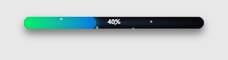 |
| `CheemsCircuitProgressBar` |  |
| `CheemsMonoProgressBar` |  |
| `CheemsWaveProgressBall` |  |
