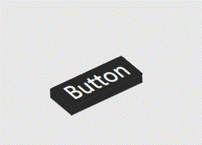

# CheemsUI

一套注重动效与质感的 WPF 自绘控件库。所有控件均以 ControlTemplate + Storyboard 纯 WPF 实现，不依赖任何第三方库；配色、字体走语义化资源键，换主题只改资源不动模板。


<p align="center">
  <a href="CONTROLS.md">
    
  </a>
</p>

## 快速开始

库目标框架 `net6.0-windows`（Demo 为 net8.0）。项目引用：

```xml
<ItemGroup>
  <ProjectReference Include="..\src\CheemsUI\CheemsUI.csproj" />
</ItemGroup>
```

XAML 中统一使用语义命名空间（无需记程序集名），默认样式通过 `ThemeInfo` 自动生效，不需要手动合并任何字典：

```xml
xmlns:cheems="https://cheemsui.com/wpf"
```

```xml
<StackPanel Width="260">
    <cheems:CheemsShineButton Content="SHINE" />
    <cheems:CheemsBounceBallLoader Margin="0,24" />
    <cheems:CheemsGlowInput Placeholder="Type here" />
    <cheems:CheemsCosmicProgressBar Value="40" Height="12" Margin="0,16" />
    <cheems:CheemsCheckToggle IsChecked="True" Margin="0,16" />
</StackPanel>
```

运行 Demo 浏览器交互查看全部控件：

```
dotnet run --project src/CheemsUI.App
```

## 特性

- **42 个控件**：按钮、加载动画（Loader）、开关、输入框、进度条五大类
- **纯 WPF 实现**：无第三方依赖，模板即全部视觉，可随意拆改
- **状态即动效**：悬停、按下、开启等状态都带过渡动画，不是贴图切换
- **语义化主题**：`Cheems.Brush.*` / `Cheems.FontFamily.*` 等资源键全局覆盖，一处改色处处生效
- **自带工具链**：Demo 浏览器 + 命令行截图导出（文档所有图都由它生成）

## 效果预览

### Loader（GIF 实录）

| | | |
|---|---|---|
|  |  |  |
|  |  |  |

### 按钮 · 交互实录（常态 → 悬停 → 按下 → 离开）



> 📖 完整控件清单与全部动效实录：**[CONTROLS.md](CONTROLS.md)**

## 主题定制

在 App 级合并主题字典并覆盖语义键，所有控件即时生效（DynamicResource）：

```xml
<Application.Resources>
    <ResourceDictionary>
        <ResourceDictionary.MergedDictionaries>
            <ResourceDictionary Source="/CheemsUI;component/Themes/Generic.xaml" />
        </ResourceDictionary.MergedDictionaries>

        <SolidColorBrush x:Key="Cheems.Brush.Primary" Color="#7C5CFF" />
        <SolidColorBrush x:Key="Cheems.Brush.Accent" Color="#FF6B9E" />
    </ResourceDictionary>
</Application.Resources>
```

常用键：颜色 `Cheems.Brush.Primary` / `Accent` / `Text.*` / `Background.*`，字体 `Cheems.FontFamily.Default` / `Mono` / `Icon`，字号 `Cheems.FontSize.*`。完整清单见 `src/CheemsUI/CheemsKeys.cs` 与 `src/CheemsUI/Themes/Basic/*.xaml`。

## 截图与 GIF 导出

文档所有图片由 Demo 程序的导出模式自动生成，可随时重跑刷新：

```
CheemsUI.App.exe --export            # 全量导出到 docs/gallery
CheemsUI.App.exe --export --only=CheemsShineButton,CheemsCheckToggle
```

全部图库为实录 GIF（24fps，自动按运动最大边界取景）。按钮 GIF 录制「常态 → 悬停 → 按下 0.3s → 抬起停留 0.5s → 离开」、开关 GIF 录制「常态 → 悬停 → 点击打开 → 移开」、输入框 GIF 录制「常态 → 悬停 → 点击聚焦 → 逐字输入 "Cheems"」完整交互，进度条 GIF 录制 0 → 100% 全程 5s，Loader 为循环动画；交互画面中的光标由 `src/CheemsUI.App/Assets/cursor.png` 合成，替换该文件后重新导出即可换光标。

## 交流

QQ 交流群：**1094431427** —— 问题反馈、控件需求、动效讨论都可以进来聊，也欢迎直接提 PR。


