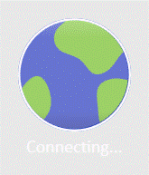
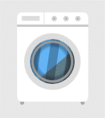

# CheemsUI

一套注重动效与质感的 WPF 自绘控件库。所有控件均以 ControlTemplate + Storyboard 纯 WPF 实现，不依赖任何第三方库；配色、字体走语义化资源键，换主题只改资源不动模板。

[](https://qm.qq.com/q/BWDv2TTZKK)





<p align="center">
  <a href="CONTROLS.md">
    
  </a>
</p>

## 快速开始

库目标框架 `net6.0-windows`（Demo 为 net8.0）。项目引用：

```xml
<ItemGroup>
  <ProjectReference Include="..\src\CheemsUI\CheemsUI.csproj" />
</ItemGroup>
```
XAML 中统一使用语义命名空间（无需记程序集名），默认样式通过 `ThemeInfo` 自动生效，不需要手动合并任何字典：

```xml
xmlns:cheems="https://cheemsui.com/wpf"
```

```xml
<StackPanel Width="260">
    <cheems:CheemsShineButton Content="SHINE" />
    <cheems:CheemsBounceBallLoader Margin="0,24" />
    <cheems:CheemsGlowInput Placeholder="Type here" />
    <cheems:CheemsCosmicProgressBar Value="40" Height="12" Margin="0,16" />
    <cheems:CheemsCheckToggle IsChecked="True" Margin="0,16" />
</StackPanel>
```

运行 Demo 浏览器交互查看全部控件：

```
dotnet run --project src/CheemsUI.App
```

