# CheemsControl

一套注重动效与质感的 WPF 自绘控件库。所有控件均以 ControlTemplate + Storyboard 纯 WPF 实现，不依赖任何第三方库；配色、字体走语义化资源键，换主题只改资源不动模板。

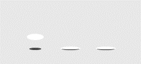


## 特性

- **40+ 控件**：按钮、加载动画（Loader）、开关、输入框、进度条四大类
- **纯 WPF 实现**：无第三方依赖，模板即全部视觉，可随意拆改
- **状态即动效**：悬停、按下、开启等状态都带过渡动画，不是贴图切换
- **语义化主题**：`Cheems.Brush.*` / `Cheems.FontFamily.*` 等资源键全局覆盖，一处改色处处生效
- **自带工具链**：Demo 浏览器 + 命令行截图导出（本页所有图都由它生成）

## 效果预览

### Loader（GIF 实录）

| | | |
|---|---|---|
| 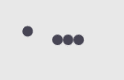 | 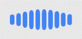 | 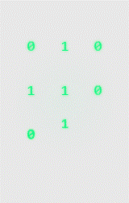 |
|  |  | 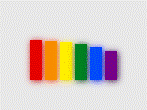 |

### 按钮 · 三态实录（常态 / 悬停 / 按下）

| 常态 | 悬停 | 按下 |
|---|---|---|
| 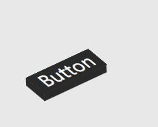 | 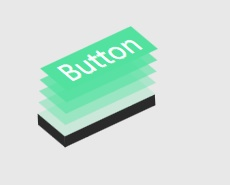 | 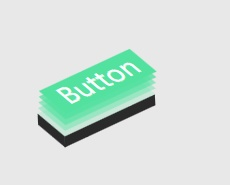 |

### 开关 · 关 / 开

| 关 | 开 |
|---|---|
| 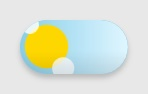 | 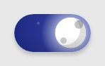 |

昼夜开关（DayNightSwitch）自带完整的日月形态渐变：太阳脉冲、月相移动、星星闪烁，全程矢量动画。

### 输入与进度

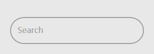 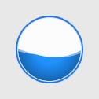

## 控件总览

**Buttons（8）**

| 控件 | 说明 |
|---|---|
| `CheemsShineButton` | 流光扫过式主按钮 |
| `CheemsLayered3DButton` | 层叠立体按压按钮 |
| `CheemsSoftButton` | 柔和底色按钮，按下带形变 |
| `CheemsDashedButton` | 虚线描边按钮 |
| `CheemsSubscribeButton` | 订阅按钮，点击后勾选动效 |
| `CheemsDeleteButton` | 删除按钮，悬停出确认叉 |
| `CheemsPixelHandButton` | 像素风手指按钮 |
| `CheemsLeafButton` | 叶形按钮 |

**Loaders（17）**

`CheemsAiMatrixLoader`、`CheemsBlobLoader`、`CheemsBounceBallLoader`、`CheemsCubeLoadingLoader`、`CheemsDominoLoader`、`CheemsEarthLoader`、`CheemsGlitchLoader`、`CheemsHamsterWheelLoader`、`CheemsJumpingSquareLoader`、`CheemsNewtonsCradleLoader`、`CheemsOrbitDotsLoader`、`CheemsPolylineLoader`、`CheemsPulseDotsLoader`、`CheemsRainbowBarsLoader`、`CheemsTypewriterLoader`、`CheemsWashingMachineLoader`、`CheemsWaveBarsLoader`

全部为无限循环动画，放入界面即自动播放；每个控件在 `Themes/Controls/*.xaml` 里有对应的专属配色键可覆盖。

**Inputs（13）**

| 控件 | 说明 |
|---|---|
| `CheemsDayNightSwitch` | 昼夜形态渐变开关 |
| `CheemsCheckToggle` | 经典勾选开关 |
| `CheemsAmPmToggle` | 上午/下午开关 |
| `CheemsGenderToggle` | 性别选择开关 |
| `CheemsIosStretchSwitch` | iOS 风拉伸开关 |
| `CheemsLedSwitch` | LED 指示开关 |
| `CheemsMechanicalToggle` | 机械拨杆开关 |
| `CheemsMetalSwitch` | 金属质感开关 |
| `CheemsPixelSwitch` | 像素风开关 |
| `CheemsPixelCoinSwitch` | 像素投币开关 |
| `CheemsScaleSwitch` | 天平式开关 |
| `CheemsGlowInput` | 聚焦发光输入框（`Placeholder` 属性） |
| `CheemsSearchBox` | 搜索框（`Label` / `Text` 属性，带清除按钮） |

**Progress（4）**

`CheemsCosmicProgressBar`、`CheemsCircuitProgressBar`、`CheemsMonoProgressBar`、`CheemsWaveProgressBall` —— 均继承自 `ProgressBar`，直接绑定 `Value` / `Minimum` / `Maximum` 使用。

## 快速开始

库目标框架 `net6.0-windows`（Demo 为 net8.0）。项目引用：

```xml
<ItemGroup>
  <ProjectReference Include="..\src\CheemsControl\CheemsControl.csproj" />
</ItemGroup>
```

XAML 中统一使用语义命名空间（无需记程序集名）：

```xml
xmlns:cheems="https://cheemscontrol.com/wpf"
```

```xml
<StackPanel Width="260">
    <cheems:CheemsShineButton Content="SHINE" />
    <cheems:CheemsBounceBallLoader Margin="0,24" />
    <cheems:CheemsGlowInput Placeholder="Type here" />
    <cheems:CheemsCosmicProgressBar Value="40" Height="12" Margin="0,16" />
    <cheems:CheemsCheckToggle IsChecked="True" Margin="0,16" />
</StackPanel>
```

控件默认样式通过 `ThemeInfo` 自动生效，**不需要**手动合并任何字典。

## 主题定制

需要在控件之外使用主题 token（或整体换肤）时，在 App 级合并主题字典并覆盖对应键：

```xml
<Application.Resources>
    <ResourceDictionary>
        <ResourceDictionary.MergedDictionaries>
            <ResourceDictionary Source="/CheemsControl;component/Themes/Generic.xaml" />
        </ResourceDictionary.MergedDictionaries>

        <!-- 全局语义键：覆盖后所有控件即时生效（DynamicResource） -->
        <SolidColorBrush x:Key="Cheems.Brush.Primary" Color="#7C5CFF" />
        <SolidColorBrush x:Key="Cheems.Brush.Accent" Color="#FF6B9E" />
    </ResourceDictionary>
</Application.Resources>
```

常用键（完整清单见 `src/CheemsControl/CheemsKeys.cs` 与 `src/CheemsControl/Themes/Basic/*.xaml`）：

| 类别 | 键 |
|---|---|
| 颜色 | `Cheems.Brush.Primary` / `Accent` / `Text.Primary` / `Text.Secondary` / `Background.Default` / `Background.Elevated` / `Border.Default` |
| 字体 | `Cheems.FontFamily.Default` / `Mono` / `Icon` |
| 字号 | `Cheems.FontSize.Caption` / `Body` / `SubTitle` / `Title` / `Large` |
| 控件专属 | 如 `Cheems.Color.DayNight.Sun`、`Cheems.Brush.CheckToggle.Track` 等 |

## 截图与 GIF 导出

本仓库 `docs/gallery/` 内的所有图片由 Demo 程序的导出模式自动生成，可随时重跑刷新：

```
# 全量导出到 docs/gallery（固定路径，重复执行会先清理旧图）
CheemsControl.App.exe --export

# 可选参数
--limit=8              只导出前 8 个控件
--only=CheemsShineButton,CheemsCheckToggle    只导出指定控件
--workers=4            并行录制线程数（默认 4）
```

命名约定：`控件名.jpg` 常态、`-hover.jpg` 悬停、`-on.jpg` 开启态（开关类）、`-press.jpg` 按下态（按钮类）；Loader 为实录 GIF（24fps，自动按运动最大边界取景）。

也可以直接运行 Demo 浏览器交互查看全部控件：

```
dotnet run --project src/CheemsControl.App
```
